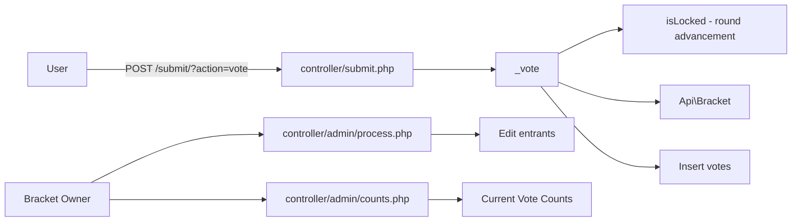

# Bracket Owner Voting Lock

## Feasibility: **Easy** (roughly 1-2 hours)

The codebase already has a similar pattern for blocking votes during round advancement (`isLocked()` in [api/bracket.php](api/bracket.php)). Both elimination votes and bracket votes use the same `_vote()` endpoint in [controller/submit.php](controller/submit.php). Adding a bracket-owner-controlled voting lock is straightforward.

**Access control:** The lock toggle is available to **bracket owners** (users who own the bracket), not just site admins. Access is enforced via `_getBracket()` in [controller/me.php](controller/me.php), which only returns brackets from `getUserOwnedBrackets()`. The UI shows the lock toggle to all bracket owners when the bracket is in eliminations or voting — no `isSiteAdmin` check.

---

## Current Architecture




- **Elimination voting**: Same as bracket voting — [controller/submit.php](controller/submit.php) `_vote()` handles both when `state` is `BS_ELIMINATIONS` or `BS_VOTING`
- **Existing lock**: `isLocked()` / `Api:Bracket:bracket_locked_{id}` — blocks votes during round advancement (temporary, not owner-controlled). We add a **separate** owner-controlled lock; do not reuse this key.
- **Bracket owner processing during eliminations**: Edit Entrants at `/me/process/{perma}/characters/`, Current Vote Counts at `/me/counts/{perma}/`
- **Vote page**: `/{perma}/vote` — shows elimination ballot when `state` is `BS_ELIMINATIONS`

---

## Implementation Plan

### 1. Bracket Model ([api/bracket.php](api/bracket.php))

Use a **separate** cache key `Api:Bracket:voting_locked_{id}` — do **not** reuse `Api:Bracket:bracket_locked_{id}` (used by `advance()`/`rollback()`). Add:

```php
/**
 * Generator for the bracket-owner voting locked cache key.
 * Uses a separate key from _lockedCacheKey (bracket_locked) so that the procedural
 * lock during advance/rollback and the owner-controlled lock don't conflict —
 * advance can run without waiting for owner to unlock, and _vote() checks both.
 */
private function _votingLockedCacheKey() {
    return 'Api:Bracket:voting_locked_' . $this->id;
}

public function isVotingLocked() {
    return (bool) Lib\Cache::getInstance()->get($this->_votingLockedCacheKey(), true);
}

public function setVotingLocked(bool $locked) {
    $cache = Lib\Cache::getInstance();
    return $cache->set($this->_votingLockedCacheKey(), $locked ? 1 : 0, CACHE_VERY_LONG);
}
```

Use `CACHE_VERY_LONG` (24 hours) so the lock doesn't expire during bracket owner processing.
Return the cache write result so endpoint handlers can fail gracefully if lock state is not persisted.

### 2. Clear Lock on Advancement ([api/bracket.php](api/bracket.php))

In `advance()` only (not `rollback()`), after `_unlock()`, call `$this->setVotingLocked(false)` so the lock is cleared when a new round starts. Do **not** clear on rollback — the bracket owner may want the lock to persist when reverting to a previous round.

### 3. Block Votes in Submit Controller ([controller/submit.php](controller/submit.php))

In `_vote()`, after the existing `isLocked()` check and before the state check (~line 126), add:

```php
if ($bracket->isVotingLocked()) {
    $out->message = 'Voting has temporarily been locked by contest admins.';
    return $out;
}
```

### 4. Bracket Owner Toggle Endpoint

Add a new action in [controller/admin/process.php](controller/admin/process.php) — or a dedicated controller if preferred:

- Route: `POST /me/process/{perma}/lock-voting/` (or extend existing process routes)
- Body: `action=lock` or `action=unlock`
- **Access:** Bracket owners only (enforced by `_getBracket()`, which checks `getUserOwnedBrackets()` — no site-admin requirement)
- Logic: Verify CSRF (`_auth`) server-side, then call `$bracket->setVotingLocked($locked)`, verify `isVotingLocked() === $locked`, and return JSON `{ success, locked }`
- **No state restriction** — bracket owners can lock/unlock whenever (eliminations, voting, etc.)
- Wire via the existing `Process::generate()` switch (e.g. new case `'lock-voting'`)

`_lockVoting` function: Toggles the voting lock for a bracket. When locked, users cannot submit votes. Accepts `action=lock` or `action=unlock` via POST, requires valid CSRF token, and returns JSON `{ success, locked }` only when write + verification succeed; otherwise return `{ success: false, message }`.

### 5. Bracket Owner UI — Actions panel ([views/admin/brackets.hbs](views/admin/brackets.hbs), [static/js/views/admin.js](static/js/views/admin.js))

In the expandable actions list (the `<ul>` under "Actions"), add a new `<li>` when the bracket is in eliminations or voting:

- **Template:** Empty `<li class="lock-voting-row">` with `data-perma`, `data-locked`, `data-csrf` — the link is rendered entirely by JS (single source of truth).
- **When unlocked**: Link "Lock Voting 🔓 → 🔒" that POSTs to `/me/process/{{perma}}/lock-voting/` with `action=lock`
- **When locked**: Link "Unlock Voting 🔒 → 🔓" that POSTs with `action=unlock` (arrow shows transition)
- Styled like other action links (dark-green, underline on hover) — not a button
- Place it after "Current Vote Counts" when in eliminations
- `renderLockLink($row)` in admin.js populates the row on init and after toggle; `toggleLockVoting` handles the fetch (with `evt.preventDefault()`) and calls `renderLockLink` on success
- Requires `votingLocked` to be set on each bracket in [controller/me.php](controller/me.php) when building the brackets list — only for brackets where `state` is `BS_ELIMINATIONS` or `BS_VOTING` (e.g. `$bracket->votingLocked = $bracket->isVotingLocked()`) to avoid unnecessary cache hits for other brackets

**Implementation notes:** The lock-voting endpoint returns JSON `{ success, locked }`. Use `fetch()` with `Content-Type: application/x-www-form-urlencoded` and `body: new URLSearchParams({ action, _auth })`. Include CSRF token (`_auth`) in the POST body. In `toggleLockVoting`, prevent duplicate in-flight requests, handle non-OK HTTP responses, handle `{ success: false }` JSON responses, and display a user-facing error message when update fails.

### 6. Vote Page UX ([controller/vote.php](controller/vote.php), vote templates)

**Controller:** Add `$out->votingLocked = $bracket->isVotingLocked();` to the `$out` object **outside** the `Cache::fetch()` closure (after `$out->bracket = $bracket;` on line 29). Do **not** put it inside the cached block — the lock state would be stale for up to `CACHE_MEDIUM` (10 minutes).

**Overlay implementation** — Reuse the existing overlay pattern from the age-requirement block in [static/js/pages/Vote/index.js](static/js/pages/Vote/index.js) (lines 150–158). The overlay uses classes from [static/scss/vote.scss](static/scss/vote.scss): `overlay`, `overlay__content`, `overlay__header`, `overlay__body`.

Add a second conditional block, mirroring the age overlay:

```jsx
{!meetsAgeRequirement ? (
  <div className="overlay">
    <aside className="overlay__content">
      <h1 className="overlay__header">Oh dear...</h1>
      <p className="overlay__body">
        Your reddit account does not meet the minimum age requirements for this bracket :(
      </p>
    </aside>
  </div>
) : votingLocked && (
  <div className="overlay">
    <aside className="overlay__content">
      <h1 className="overlay__header">Voting Locked</h1>
      <p className="overlay__body">
        Voting has temporarily been locked by contest admins.
      </p>
      <a href={`/${bracket.perma}/characters`}>Go to Entrants</a>
    </aside>
  </div>
)}
```

This replaces the existing `!meetsAgeRequirement` block with an if/else: age requirement takes priority, otherwise show the voting locked overlay if applicable.

- **Props:** Add `votingLocked` to the `Vote` component props and pass it from `window._appData` in the route's `initRoute`.
- **Link:** Include a plain link "Go to Entrants" to `/{perma}/characters` so users can navigate away. Use Entrants (not Bracket Results) because Entrants is available in both eliminations and voting phases; Bracket Results only exists during voting.
- **Styling:** No new CSS — reuse existing `.overlay` styles. The overlay is `position: fixed` full viewport, dark semi-transparent backdrop, centered white card with header and body text. The link uses default styling (no custom CSS).

---

## Files to Modify


| File                                                                           | Change                                                                                                                          |
| ------------------------------------------------------------------------------ | ------------------------------------------------------------------------------------------------------------------------------- |
| [api/bracket.php](api/bracket.php)                                             | Add `isVotingLocked()`, `setVotingLocked()`, clear lock in `advance()` only; return cache write status from `setVotingLocked()` |
| [controller/submit.php](controller/submit.php)                                 | Check lock in `_vote()` (no state restriction)                                                                                  |
| [controller/admin/process.php](controller/admin/process.php)                   | New `lock-voting` action; verify write + effective lock state before returning success                                          |
| [controller/me.php](controller/me.php)                                         | Pass `votingLocked` when building brackets list (eliminations/voting)                                                           |
| [controller/vote.php](controller/vote.php)                                     | Pass `votingLocked` to vote template                                                                                            |
| [views/admin/brackets.hbs](views/admin/brackets.hbs)                           | Empty `lock-voting-row` container with data attrs                                                                               |
| [static/js/views/admin.js](static/js/views/admin.js)                           | `renderLockLink()`, init + toggle handler (link, not button), plus network/JSON error handling                                  |
| Vote template / [static/js/pages/Vote/index.js](static/js/pages/Vote/index.js) | Conditional message when voting locked                                                                                          |


