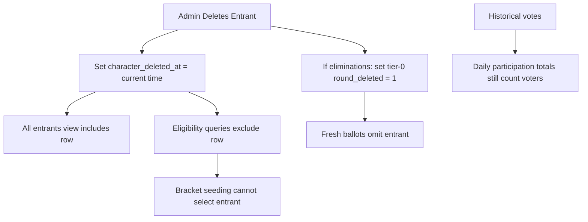

# Entrant Soft Delete Plan

## Things To Resolve Before Execution

- Decide deletion behavior for accepted entrants during nominations:
  - Option A: keep nomination-phase accepted entrant deletion as a hard delete. This matches the current low-history state: there are no elimination rounds or votes yet, so there is less value in retaining the row.
  - Option B: use `character_deleted_at` for both nominations and eliminations. This gives one consistent deletion model and keeps admin/public roster history even before voting begins.
- Decide whether public/admin all-entrant lists should show nomination-phase deleted entrants if Option B is chosen.
- Decide how deleted entrants should be indicated on public/admin Entrants/Characters frontend views:
  - Product wording: examples include "Deleted", "Removed", "Removed from voting", or "Ineligible".
  - Visual treatment: examples include a small status badge, muted row/card styling, image overlay, or a separate deleted section.
  - Scope: decide whether the marker appears only in admin views, also on public `/characters`, and/or in API consumers that render entrants elsewhere.
- Until this is resolved, treat `character_deleted_at` as definitely needed for elimination-phase soft deletes, but do not assume nomination-phase accepted entrants must use it.

## Data Model

- Add nullable `character_deleted_at INT(11) DEFAULT NULL` to the `character` table schema in [database.sql](database.sql), plus a migration SQL file such as [sql/add_character_deleted_at.sql](sql/add_character_deleted_at.sql).
- Treat `NULL` as active and a Unix timestamp as deleted. This preserves the simple eligibility check while recording when the entrant was removed.
- Extend `Api\Character` in [api/character.php](api/character.php):
  - Add `'deletedAt' => 'character_deleted_at'` to `$_dbMap`.
  - Add `public $deletedAt = null`.
  - Normalize `$this->deletedAt` to `null` or an integer timestamp in `copyFromDbRow()`.
  - Optionally expose a derived `$deleted` boolean for frontend/template convenience, based on whether `deletedAt` is non-null.
  - Add a small method like `softDelete()` that sets `deletedAt = time()`, persists the row, and handles related elimination-round cleanup.

## Deletion Behavior

- For elimination-phase accepted entrants, replace the current hard delete in [controller/admin/process.php](controller/admin/process.php):

```php
if ($character->delete()) {
```

with a soft-delete call.

- Keep the existing phase gate: deletion remains allowed only during nominations and eliminations.
- For nomination-phase accepted entrants, defer final behavior until the pre-execution decision above is resolved.
- When deleting during eliminations, mark the entrant's tier-0 round as `round_deleted = 1` so fresh ballots and active-round queries stop showing that entrant.
- Clear relevant caches after deletion: character roster, current round cache, bracket round cache patterns where feasible, and elimination count/result caches.

## Active vs All Entrants

- Rename `Api\Character::getByBracketId($bracketId)` to `Api\Character::getAllByBracketId($bracketId)` for roster/history callers. This method includes soft-deleted entrants and should be used by public roster views like [controller/characters.php](controller/characters.php), admin entrant lists, and full-roster API responses.
- Add `Api\Character::getActiveByBracketId($bracketId)` for eligibility/current-entry callers. This method filters to `character_deleted_at IS NULL`.
- Avoid a boolean `$includeDeleted` parameter; separate method names make call sites easier to audit.
- Use the active-only behavior anywhere the code means eligible/current entrants, especially:
  - entrant counts before eliminations in [controller/admin/start.php](controller/admin/start.php),
  - randomized tier-0 round creation in [controller/admin/start.php](controller/admin/start.php),
  - random entrant previews in [api/character.php](api/character.php),
  - nomination/autocomplete duplicate lookup in [api/character.php](api/character.php), so deleted entrants do not block re-adding a replacement.

## Elimination Seeding and Counts

- Update [sql/proc_GetEliminationGroupsCharacterVotes.sql](sql/proc_GetEliminationGroupsCharacterVotes.sql) to join/filter on `c.character_deleted_at IS NULL` so soft-deleted entrants cannot qualify for bracket seeding or appear in adjusted elimination rankings.
- Do not exclude soft-deleted characters from [sql/proc_GetEliminationVotesForGroups.sql](sql/proc_GetEliminationVotesForGroups.sql), because that procedure represents participating voters for the day.
- Important nuance: if soft-deleting during eliminations marks the entrant's tier-0 round as `round_deleted = 1`, then `proc_GetEliminationVotesForGroups` should not rely on `round_deleted = 0` for participation totals. It should continue counting votes cast for that elimination group/day, including votes for entrants later deleted.
- Adjusted vote computation should therefore use active entrants as the candidate list, while using all participating voters as the group/day denominator. In other words: deleted entrants are counted for turnout normalization, but are not eligible ranking candidates.



## Voting Safety

- Harden [controller/submit.php](controller/submit.php) so vote submission verifies each posted character belongs to the posted open round and is not soft-deleted.
- This protects against stale elimination pages where a user loaded the ballot before an entrant was deleted.

## UI Updates

- In [static/js/components/AdminEntrantList/index.js](static/js/components/AdminEntrantList/index.js), do not remove the entrant row after delete. Update local state so the row remains visible with `deletedAt` set, plus any derived `deleted` display flag.
- In [static/js/components/AdminEntrantItem/index.js](static/js/components/AdminEntrantItem/index.js), visually mark deleted entrants and hide/disable the delete button for them.
- In the legacy admin template [views/admin/characters.hbs](views/admin/characters.hbs), show deleted state and suppress delete actions for already-deleted entrants.
- On public entrant views, keep deleted entrants visible. Optionally add a small "Deleted" or "Removed" label so users understand why they are not in voting/bracket results.

## Validation

- Delete during nominations: validate according to the chosen pre-execution behavior. If hard delete is chosen, the entrant is removed entirely before eliminations. If soft delete is chosen, the entrant remains in all-entrant/admin lists but is excluded from elimination setup.
- Delete during eliminations before group opens: entrant is omitted from fresh ballots and cannot qualify.
- Delete during active elimination group: fresh ballots omit entrant; stale vote submissions are rejected or ignored.
- Soft-deleted entrant with many votes does not appear in adjusted elimination rankings or final seeded bracket.
- Daily participation totals still include voters who voted for the deleted entrant.
- Public `/characters` and `/api/characters` all-entrant responses still include soft-deleted entrants.
- Random previews, typeahead, and active voting surfaces exclude soft-deleted entrants where eligibility/current-entry behavior is intended.