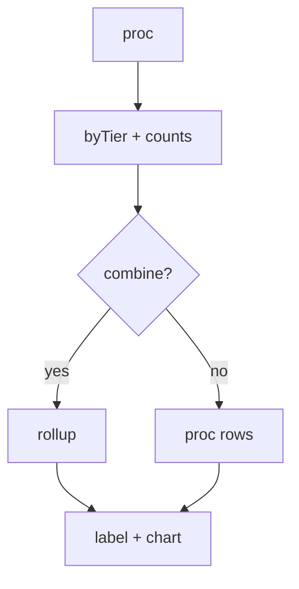

# Fix Vote Stats Chart Grouping

## Problem

Stats proc is per `(tier, group)`; `getBracketRounds` sometimes merges a whole tier. Chart had extra bars and weak labels.

## Fix

- `getVotingStats`: `getRoundCountsByGroup` for matchup counts; combine tier when `max(counts) <= COMBINE_GROUP_THRESHOLD` **or** `sum(counts) <= COMBINE_TIER_MAX_TOTAL_MATCHUPS`; rollup SQL with `COUNT(DISTINCT user_id)`; merged rows `group: null`. Chart row order: `ksort` tiers then groups, append in that order (no extra sort).
- `_votingStatsChartLabel`: eliminations + Quarter/Semi/Title from matchup totals; else `Round {tier}` + group if split.
- `stats.js`: `item.label || 'Unknown'`.

**Files:** [api/round.php](api/round.php), [static/js/views/admin/stats.js](static/js/views/admin/stats.js)

**Cache:** `Api:Round:getVotingStates_{bracketId}` after changes.

