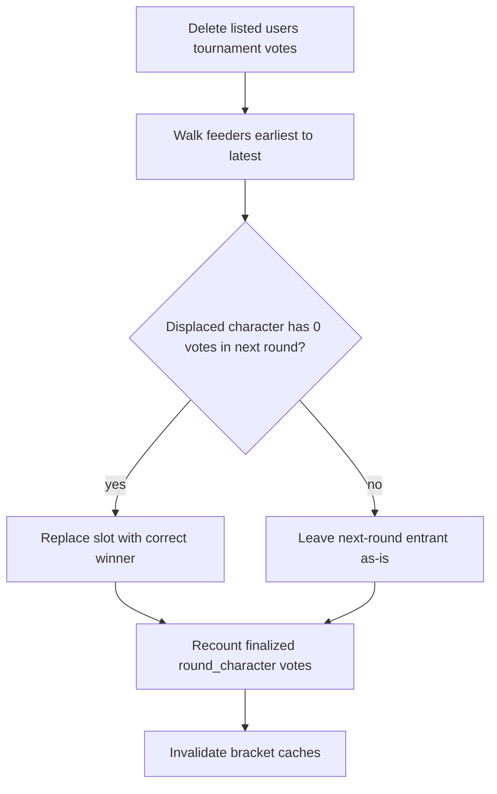

# Purge Bracket Votes (Conditional Cascade)

## Why not rollback + re-advance

Existing [`proc_RollbackBracket`](sql/proc_RollbackBracket.sql) / [`Bracket::rollback()`](api/bracket.php) is the wrong tool here:

1. After un-finalizing rounds, it **deletes all votes** on those rounds (everyone’s), including the votes needed to re-decide winners.
2. Calling [`advance()`](api/bracket.php) again would recreate later tiers and finalize them from **empty** intermediate rounds (seed tiebreak), destroying legitimate voting history.

## Approach

New CLI script: [`scripts/purge-bracket-votes.php`](scripts/purge-bracket-votes.php) (bootstrap like [`cron/advance.php`](cron/advance.php): `config.php` + `app-config.php` + `lib/aal.php`).

**Invocation (dry-run by default):**

```bash
php scripts/purge-bracket-votes.php --bracket=<id|perma> --users=12,34,56
php scripts/purge-bracket-votes.php --bracket=<id|perma> --users=12,34,56 --apply
```

Users are numeric `user_id` only.



### Steps

1. **Resolve bracket** by numeric id or perma; require `BS_VOTING` only (not eliminations, not final).
2. **Resolve users** by `user_id`; fail if any id is missing.
3. **Report** (always): tournament vote counts per user, per tier/group, finalized vs open. Mention any tier-0 votes found for these users but leave them untouched.
4. **Delete** only tournament votes via join:

```sql
DELETE v FROM votes v
INNER JOIN round r ON r.round_id = v.round_id
WHERE v.bracket_id = :bracketId
  AND v.user_id IN (...)
  AND r.round_tier >= 1
```

Elimination (`round_tier = 0`) votes are never read for repair logic and never deleted.

5. **Conditional cascade** for tournament rounds (`round_tier >= 1`, `round_deleted = 0`), earliest tier → latest:
   - Mirror advance pairing from [`_advanceBracket`](api/bracket.php): consecutive rounds in a completed tier/group feed the next tier (`order = i/2`, `character1` = winner of round `i`, `character2` = winner of round `i+1`; third-place match gets the two losers when present).
   - Recompute each feeder’s winner via `Round::getWinnerId()` / `getLoserId()` (live remaining `votes` + seed tiebreak in [`proc_GetRoundWinner`](sql/proc_GetRoundWinner.sql)).
   - If the next round already has the correct character in that slot → nothing to do.
   - If the next round has the **wrong** character (e.g. Char D) in that slot:
     - Count Char D’s votes in that next round **after** step 4’s purge delete (so ballots from the purged users are already gone). A round that has not opened for voting yet (or has opened but received no ballots for Char D) counts as zero.
     - **Cascade** only when that post-delete count is **zero**: update the slot to the correct winner; nothing left to strip for the removed character (opponent votes, if any, stay).
     - **Otherwise accept history**: leave the next-round entrant unchanged even if the feeder recount says they should have lost. Contest continues; feeder tallies after recount may disagree with who advanced (dry-run must call this out).
   - Walk forward so a cascade into an empty later round can itself cascade further under the same rule.

6. **Recount denormalized tallies** on every finalized tournament round (always, including accepted historical mismatches): set `round_character1_votes` / `round_character2_votes` from `COUNT` of remaining votes (same logic as [`Round::getVoteCount()`](api/round.php) + [`finalizeRound()`](api/round.php)). Leave non-finalized rounds’ stored counts `NULL`.

7. **Cache bust**:
   - Long-lived Redis: `Api:Bracket:getResults_{id}`, `Api:Round:getVotingStates_{id}` (admin vote chart), `Api:Bracket:getVotesForUser_{id}_{userId}` for purged users; force-refresh `Stats::getEntrantPerformanceStats($bracket, true)`.
   - Memcache `GetBracketRounds_*` is per-user with medium TTL; after a cascade on an open round, ballots may briefly show old entrants until expiry (same general pattern as normal advance). No other durable cache of vote tallies.

Dry-run prints the full plan (rows to delete, cascades vs accepted mismatches, recount diffs) and makes **no writes**.

## Related data audit

Durable DB state that vote purge can affect:

| Store | Action |
|-------|--------|
| `votes` | Delete purged users’ `tier >= 1` rows |
| `round.character1/2` | Conditional cascade only |
| `round.character1/2_votes` | Always recount when `final` |
| `character.seed`, nominees, elim votes | Untouched (out of scope) |
| `bracket.winner` / `BS_FINAL` | N/A (script refuses finals) |
| `bracket.score` | Untouched (cron owns this) |

Everything else (open-round live counts, affinity/`ai_projections`, CSV download, “have I voted”) reads `votes` directly or short caches. Accepted historical mismatches (feeder recount vs who advanced when cascade is blocked) can make results/stats *look* inconsistent; that is intentional, not a missed write.

## What “correct end state” means

| Data | After script |
|------|----------------|
| Purged users’ tournament votes (`tier >= 1`) | Gone |
| Elimination votes (`tier = 0`) | Untouched |
| Finalized tournament `round_character*_votes` | Recounted from remaining votes |
| Next-round slot when displaced character has 0 votes there (after purge) | Corrected to true winner |
| Next-round slot when displaced character still has votes after purge | Left as-is (accept advancement) |
| Contest continuation | Unaffected |

## Out of scope

- Admin UI
- Eliminations votes, eliminations state, or rebuilding seeding from elims
- Finalized (`BS_FINAL`) brackets
- Identifying users by Reddit name
- Forcing bracket structure to match recount when later rounds already have votes for the displaced character
