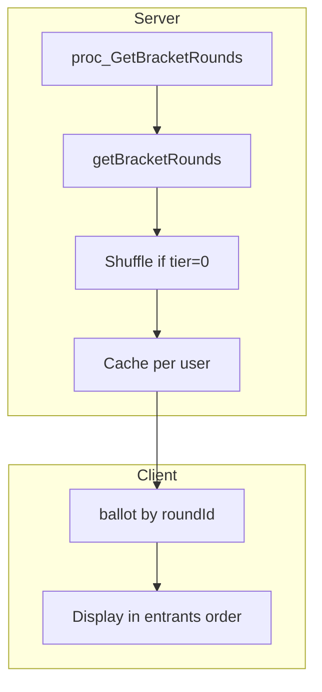

# Randomize Elimination Voting Order

## Current Behavior

- **Data flow**: [controller/vote.php](controller/vote.php) calls `Api\Round::getCurrentRounds()` which uses `getBracketRounds()` and `proc_GetBracketRounds`. Rounds are returned ordered by `round_group ASC, round_order ASC` (see [sql/proc_GetBracketRounds.sql](sql/proc_GetBracketRounds.sql) lines 41-43).
- **Display**: [static/js/pages/Vote/index.js](static/js/pages/Vote/index.js) iterates with `Object.keys(ballot).map(roundId => ...)`. In JavaScript, numeric string keys are iterated in ascending numeric order, so entrants effectively display by round ID.
- **Voting**: Submissions use `round:${roundId}` and character ID ([useVoteForm.js](static/js/pages/Vote/useVoteForm.js) lines 61-63). Order is irrelevant for vote processing.

## Implementation

### 1. Server-side: Shuffle rounds for eliminations

**File**: [api/round.php](api/round.php)

In `getBracketRounds()`, insert after the character assignment loop and before the closing `}` of the `if ($result && $result->count > 0)` block (after line 221, before line 224). Place inside that block so we only shuffle when we have rounds. Only when `$tier == 0` (eliminations):

- Shuffle `$retVal` using a deterministic seed so each user sees a consistent order (same on refresh) but different from other users.
- Seed: `crc32($user->id . '_' . $bracketId . '_' . $tier . '_' . ($group !== false ? $group : 'all'))` — include user ID so each user gets their own random order.
- Use `mt_srand($seed)` followed by `shuffle($retVal)`.

**Why `mt_srand` is safe here**: `mt_srand()` seeds the global Mersenne Twister RNG, which affects any later `mt_rand()` or `shuffle()` calls in the same request. In PHP (PHP-FPM, mod_php), each HTTP request runs in its own process and exits when done. The next request starts with a fresh RNG state, so we don't affect other requests. Our shuffle runs near the end of the vote page load, so the risk to other code is negligible.

**No interference with `entrantSwap`**: In [controller/vote.php](controller/vote.php) lines 44-56, the `entrantSwap` feature uses `rand()` (not `mt_rand()`). The project runs PHP 7.4 (see [Dockerfile](Dockerfile) line 11), and in PHP 7.1+, `rand()`/`srand()` and `mt_rand()`/`mt_srand()` use separate RNG states. So our `mt_srand()` call cannot affect the `entrantSwap` logic.

**Other callers of `getBracketRounds`/`getCurrentRounds` are unaffected**: `_advanceBracket()` in [api/bracket.php](api/bracket.php) (line 419) pairs rounds by sequential index (`$rounds[$i]` vs `$rounds[$i + 1]`), but it only runs for `tier > 0` (bracket voting), and our shuffle only applies to `tier == 0` (eliminations). `_advanceEliminations()` uses a stored procedure (`proc_AdvanceEliminationRound`) and doesn't iterate over `getCurrentRounds()` at all.

```php
// Only shuffle for eliminations (tier 0); same entrants for everyone, random order per user
if ($tier == 0 && count($retVal) > 1) {
    $seed = crc32($user->id . '_' . $bracketId . '_' . $tier . '_' . ($group !== false ? $group : 'all'));
    mt_srand($seed);
    shuffle($retVal);
}
```

### 2. Client-side: Preserve server order when rendering

**File**: [static/js/pages/Vote/index.js](static/js/pages/Vote/index.js)

Replace `Object.keys(ballot).map(roundId => ...)` with iteration over the `rounds` array so display order of entrants matches the server-provided (shuffled) order:

- **Why**: In JavaScript, `Object.keys()` on an object with numeric string keys (e.g. `"312787"`) returns keys in ascending numeric order, not insertion order. So the current code already doesn't preserve DB order—entrants display by round ID. To honor the server's shuffled order, we must iterate over the `rounds` array instead.
- Add `Fragment` to the React import: `import React, { useState, useMemo, Fragment } from 'react'` (needed because `Fragment` with a `key` prop requires the named component; the `<>` shorthand doesn't support keys).
- Use `(rounds || []).map(...)` to guard against `rounds` being undefined.
- Add a guard for `ballot[round.id]` since useMemo sets ballot asynchronously on first render.
- Wrap each item in `<Fragment key={round.id}>` for stable keys.
- Extract `roundId = round.id` in the map callback to avoid repetition.
- Update `handleCopyClick` to iterate over `(rounds || [])` instead of `Object.keys(ballot)` so the Share Votes as Markdown output order matches the display order.

`**roundId` type change (string to number) is safe**: With `Object.keys`, `roundId` was a string. With `rounds.map`, `round.id` is a number from JSON. This doesn't cause issues because `roundId` is never used in a strict equality (`===`) comparison. It's only used for: (1) object property access (`ballot[roundId]`) where JS coerces to string, (2) computed property keys (`{ [roundId]: ... }`) where JS also coerces, and (3) template literals (`round:${roundId}`) where JS coerces too. The `===` checks in `selectEntrant` compare `character1.id` with `entrantId`, which are both always numbers from JSON — `roundId` is not involved.

**Bracket voting display order is unchanged**: This `rounds.map` change applies to all voting states, not just eliminations. However, for bracket voting, the server returns rounds sorted by `round_group ASC, round_order ASC`, and round IDs are auto-increment, so the `rounds` array order matches what `Object.keys` would produce (ascending numeric). The display order is effectively identical.

```jsx
{(rounds || []).map(round => {
  const roundData = ballot[round.id];
  if (!roundData) return null;
  const roundId = round.id;
  const { character1, character2 } = roundData;
  return (
    <Fragment key={roundId}>
      <li
        className={classnames(
          'mini-card',
          {
            'mini-card--left entrant1': isVoting,
          },
        )}
        key={`entrant-${character1.id}`}
        onClick={() => selectEntrant({ roundId, entrantId: character1.id })}
      >
        <BallotEntrant roundId={roundId} {...character1} />
      </li>
      {isVoting && (
        <li
          className="mini-card mini-card--right entrant2"
          key={`entrant-${character2.id}`}
          onClick={() => selectEntrant({ roundId, entrantId: character2.id })}
        >
          <BallotEntrant roundId={roundId} {...character2} />
        </li>
      )}
    </Fragment>
  );
})}
```

`handleCopyClick` uses `(rounds || []).reduce(...)` instead of `Object.keys(ballot).reduce(...)` so the Share Votes as Markdown output matches the display order.

### 3. Voting verification

No changes needed to vote submission. Votes are submitted as `round:${roundId}` and `characterId` (see [useVoteForm.js](static/js/pages/Vote/useVoteForm.js)). The backend looks up rounds by ID, not by position, so display order is irrelevant—voting works correctly regardless of how entrants are ordered on screen.

## Data Flow Diagram




## Scope: Eliminations Only

Randomization applies only to elimination voting (`tier == 0`). Bracket voting (`tier > 0`) is unchanged because:

- Bracket rounds have a fixed structure (semifinals, finals, etc.) with a meaningful display order.
- The order-bias concern applies to eliminations, where many entrants are shown at once.
- Bracket voting is head-to-head with fewer rounds, so position bias is less of an issue.

## Edge Cases

- **Cache**: The `getBracketRounds` cache key includes `$user->id`. Each user gets their own cache entry with their own shuffled order (seed includes user ID).
- **Bracket voting (tier > 0)**: Shuffle is skipped; existing order preserved.
- **Guests**: Not applicable. Guests cannot view the vote page—they are redirected to login. The only exception is `?readonly=1`, which is a narrow, uncommon path.
- **Deterministic seed stability**: The seed includes the group number, so each elimination day (which advances to a new group) produces a different shuffle per user. Within a single day/group, each user sees a stable order across page reloads, but different users see different orders.

## Build Step

After editing [static/js/pages/Vote/index.js](static/js/pages/Vote/index.js), the JS bundle must be rebuilt for changes to take effect in the browser.