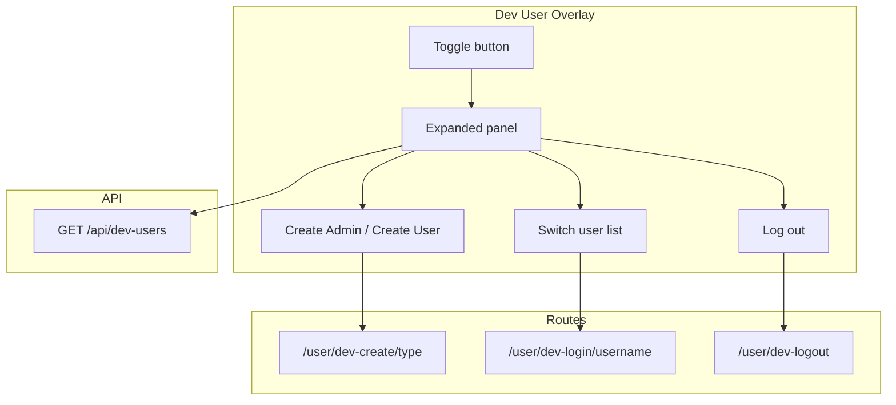

# Testing Environment Login System

## Current State

- **Single dev user**: `/user/dev-login` always logs in as `devadmin` (admin). No normal-user option.
- **No switching**: Must logout and re-login to change users.
- **User model**: `user_admin` (0 = normal, 1 = site admin), `user_name`, `user_age` (> 0 required).

## Proposed Design: Bottom-Right Overlay Menu

A floating overlay box in the bottom-right corner that appears on all pages when `DEV_LOGIN` is enabled. It provides a single interface for user control in the testing environment.

### 1. Overlay UI (Bottom-Right Corner)

- **Position**: Fixed, bottom-right (e.g. 16px from edges), above the footer.
- **Collapsed state**: Toggle button labeled "Dev Account Selector", red (#a94442), expands the menu on click.
- **Expanded state**: Card/panel showing the full menu. Click outside or on toggle again to collapse.
- **Always visible** when `DEV_LOGIN` is true, on every page (including login page when logged out).

### 2. Menu Contents

**When logged in:**

- Current user display: "Logged in as devadmin_a3f9 (admin)" or "devuser_b7e2 (user)"—server-rendered from `user` in template context.
- **Create new admin user** / **Create new normal user**: Shown above Switch user; creates a new dev user and logs in as them.
- **Switch user**: List of other dev users (fetched from API), excluding current user. Click to switch (navigates to `/user/dev-login/{username}?redirect=currentUrl`).
- **Log out** or **Be logged out**: Clears session. Redirects to current page so overlay then shows logged-out options.

**When logged out:**

- **Create new admin user**: Creates a new dev admin (e.g. `devadmin_a3f9`) and logs in as them.
- **Create new normal user**: Creates a new dev user (e.g. `devuser_b7e2`) and logs in as them.
- **Login as**: List of existing dev users you created. Click to switch to that user.

### 3. User Isolation (Multiple Testers)

**Goal**: When multiple people test, each tester only sees and can switch to users they created. No cross-use of test accounts.

**Approach: Cookie-based "my dev users"** (no DB changes):

- Cookie `dev_users_created`: comma-separated user IDs (e.g. `123,456,789`). Path `/`, long-lived (e.g. 1 year), HttpOnly, SameSite `Lax` (with backward-compatible handling for older PHP). Parse: split on comma, cast to int, ignore non-numeric; empty/malformed = empty list.
- When you create a user via `/user/dev-create/{type}`, the route sets/updates this cookie (append the new user's ID).
- GET `/api/dev-users/` reads the cookie and returns only users whose IDs are in it.
- `/user/dev-login/{username}`: before switching, verify the target user's ID is in the cookie. Reject if not.

Result: Alice's cookie has `[1,2,3]`, Bob's has `[4,5]`. Each only sees and can switch to their own users.

### 4. Backend: Routes and API (DEV_LOGIN only)

| Route / Endpoint                | Method | Behavior                                                                                                      |
| ------------------------------- | ------ | ------------------------------------------------------------------------------------------------------------- |
| `/api/dev-users/`               | GET    | Returns dev users whose IDs are in `dev_users_created` cookie. Empty/malformed cookie = `[]`.                 |
| `/user/dev-create/{admin|user}` | GET    | Create a new dev admin/user, append cookie ID, set session, redirect.                                         |
| `/user/dev-login/{username}`    | GET    | Get user by name; verify ID is in `dev_users_created` cookie; set session, redirect. Reject if not in cookie. |
| `/user/dev-logout/?redirect=`   | GET    | Clear session, redirect to `redirect` param (or `/brackets/`).                                                |

**User creation logic**: Generate a short random hex suffix (e.g. 4 chars). Create `devadmin_{suffix}` or `devuser_{suffix}`. If name collision (unlikely), regenerate.

**Remove old dev-login**: Delete the current `/user/dev-login` (no username, hardcoded devadmin) entirely. Visiting `/user/dev-login` with no username: redirect to `/`.

- Extend [controller/user.php](controller/user.php): Replace old `dev-login` block with `dev-login/{username}`, `dev-create/{type}`, and `dev-logout` actions. The overlay is the sole entry point.
- Restrict usernames to `devadmin_*` / `devuser_*` pattern to avoid impersonating real users.
- **dev-login verification**: Before switching, ensure target user's ID is in `dev_users_created` cookie; redirect to `/` with error if not.
- **If `DEV_LOGIN` is disabled**, requests to `/user/dev-login`, `/user/dev-create`, and `/user/dev-logout` return `404` and exit (no login-page fallback).
- **All new actions must `exit` after `header('Location: ...')`** (the existing `logout` action has a bug where it doesn't `exit`; don't replicate it).

### 5. Documentation Updates

- **TEST-ENV-CHANGES.md**: Replace the "Dev Login (Bypass Reddit OAuth)" section with the new overlay-based flow. Remove references to `/user/dev-login`; document the bottom-right overlay, create/switch/logout, and API endpoints.
- **syre-testing.txt**: Change step 1 from "go to [http://localhost:8080/user/dev-login](http://localhost:8080/user/dev-login)" to "use the Dev overlay (bottom-right corner) to create or log in as a user".

### 6. Layout and Template Changes

- Add `DEV_LOGIN` to template context in [controller/page.php](controller/page.php) so layouts can conditionally render the overlay.
- New `static/scss/dev-user-overlay.scss` (toggle red #a94442); add `@import "dev-user-overlay"` to [static/scss/index.scss](static/scss/index.scss).
- New partial [views/partials/_dev-user-overlay.hbs](views/partials/_dev-user-overlay.hbs): markup for the overlay (toggle labeled "Dev Account Selector" + expandable panel). Toggle styled red (#a94442). Single create block (no duplication); Switch/Login merged into one block with conditional label ("Switch user:" vs "Login as:").
- Include `{{>_dev-user-overlay}}` in [views/layouts/default.hbs](views/layouts/default.hbs) and [views/layouts/admin.hbs](views/layouts/admin.hbs) when `DEV_LOGIN`.
- Login page uses default layout, so overlay will appear when logged out.

### 7. Frontend: Overlay Component

- New JS module that:
  - Toggles expand/collapse on button click.
  - Fetches `/api/dev-users/` when expanded to populate the user list.
  - "Create new admin user" / "Create new normal user": Navigate to `/user/dev-create/admin?redirect=...` or `/user/dev-create/user?redirect=...` (single request; server creates, sets session + cookie, redirects). Shown in both logged-in and logged-out states.
  - "Switch to X" / "Login as X": Navigate to `/user/dev-login/{username}?redirect=...`.
  - "Log out": Navigate to `/user/dev-logout/?redirect=...`.
  - Redirect target uses the **full current URL** (`pathname + search + hash`) so query-state and anchors are preserved after create/switch/logout.
- Use existing patterns (jQuery or vanilla JS). Add `DevUserOverlay.init()` in [static/js/app.js](static/js/app.js) alongside `Nav.init()`; init checks for `#dev-user-overlay` and no-ops if absent.

### 8. Data Flow

### 9. Files to Create/Modify

| File                                                                         | Changes                                                                                                                           |
| ---------------------------------------------------------------------------- | --------------------------------------------------------------------------------------------------------------------------------- |
| [controller/page.php](controller/page.php)                                   | Add `DEV_LOGIN` to `Lib\Display::addKey` when defined                                                                             |
| [controller/user.php](controller/user.php)                                   | Replace old `dev-login` with `dev-login/{username}`, `dev-create/{type}`, `dev-logout`; exit after redirects                      |
| [controller/api.php](controller/api.php)                                     | Add `dev-users` (GET) case; gate on `DEV_LOGIN`                                                                                   |
| [api/user.php](api/user.php)                                                 | Add `getDevUsersCreatedCookieIds()`, `getDevUsers($cookieIds)`, and `createDevUser($admin)`                                       |
| [views/partials/_dev-user-overlay.hbs](views/partials/_dev-user-overlay.hbs) | New overlay markup (toggle + panel structure)                                                                                     |
| [views/layouts/default.hbs](views/layouts/default.hbs)                       | Include `_dev-user-overlay` when `DEV_LOGIN`                                                                                      |
| [views/layouts/admin.hbs](views/layouts/admin.hbs)                           | Same                                                                                                                              |
| [static/scss/](static/scss/)                                                 | New styles for `.dev-user-overlay` (bottom-right, fixed, red toggle #a94442, expandable). Single `__switch` block (no `__login`). |
| [static/js/](static/js/)                                                     | New DevUserOverlay component; wire into app entry when overlay exists                                                             |
| [TEST-ENV-CHANGES.md](TEST-ENV-CHANGES.md)                                   | Replace dev-login section with overlay docs; remove `/user/dev-login` reference                                                   |
| [syre-testing.txt](syre-testing.txt)                                         | Update step 1: use Dev overlay (bottom-right) instead of `/user/dev-login`                                                        |
| [docker-compose.yml](docker-compose.yml)                                     | Remove `./sql/dev-user.sql` mount from db service                                                                                 |
| [config.sample.php](config.sample.php)                                       | Update DEV_LOGIN comment to describe overlay                                                                                      |
| [sql/dev-user.sql](sql/dev-user.sql)                                         | Delete file (devadmin seed no longer used)                                                                                        |

**Simplifications:**

- **Cookie parsing**: `Api\User::getDevUsersCreatedCookieIds()` centralizes cookie parsing; `controller/api.php` and `controller/user.php` both use it (no duplicated logic).
- **Template**: Create block appears once; Switch/Login share one block with conditional label.

### 10. Security

- All dev endpoints and overlay gated by `DEV_LOGIN`.
- Username pattern restriction: only `devadmin_`* / `devuser_*` to prevent impersonation. Pattern check on creation; cookie check on switching (defense-in-depth: pattern protects creation, cookie protects switching).
- `getDevUsers()` returns only users whose IDs are in the cookie (no pattern filter needed; cookie is the source of truth).
- **Production safety**: When `DEV_LOGIN` is not defined, dev endpoints (`/api/dev-users`, `/user/dev-create`, `/user/dev-login`, `/user/dev-logout`) must return 404 or redirect away—never expose dev functionality.

### 11. Verification (Manual Testing)

After implementation, verify:

- Create admin and normal user (when logged in or out); both appear in switch list; switch between them works.
- Log out; overlay shows create/login options; log back in works.
- On a URL with query params/anchor, create/switch/logout returns to the same full URL (path + query + hash).
- Open second browser/incognito; create users; confirm cookie isolation (each browser has its own pool).
- With `DEV_LOGIN` undefined (or false), overlay does not appear; dev endpoints return 404.
- Delete sql/dev-user.sql and remove docker mount; fresh DB has no seed user; first create works.

